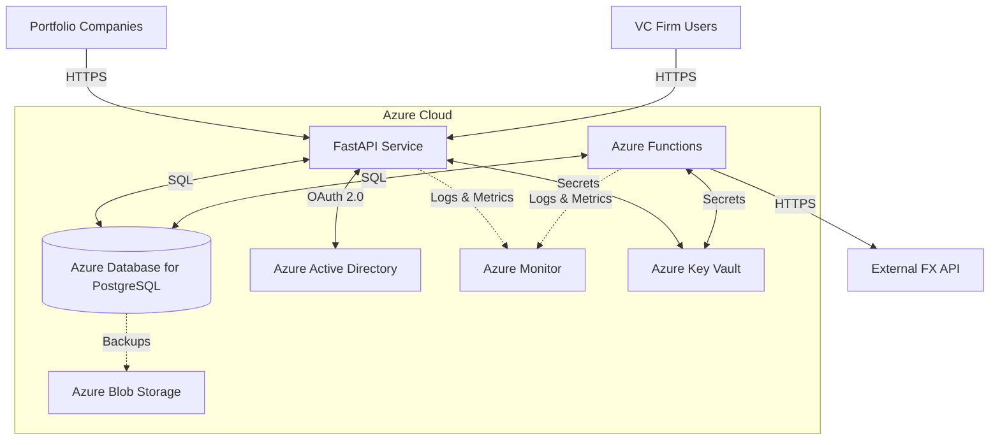

# VC Financial Reporting Metrics Backend Platform

## Introduction

This repository contains the backend platform for storing and retrieving financial reporting metrics for a VC firm's portfolio companies. The system provides a robust, scalable, and secure solution for managing financial data, enabling informed investment decisions and streamlined reporting processes.

## System Architecture

The backend platform is built using a modern, cloud-native architecture leveraging Azure services:



## Project Structure

The project is organized into the following main components:

- `src/backend/`: FastAPI application for the REST API
- `src/database/`: Database models, migrations, and utilities
- `infrastructure/`: Terraform configurations for Azure infrastructure
- `.github/`: GitHub Actions workflows for CI/CD

## Prerequisites

- Python 3.9+
- Docker
- Terraform >= 0.14.9
- Azure CLI
- Azure subscription

## Getting Started

1. Clone the repository:
   ```
   git clone https://github.com/your-org/vc-financial-reporting-backend.git
   cd vc-financial-reporting-backend
   ```

2. Set up the backend:
   ```
   cd src/backend
   python -m venv venv
   source venv/bin/activate  # On Windows, use `venv\Scripts\activate`
   pip install -r requirements.txt
   ```

3. Set up the database:
   ```
   cd src/database
   alembic upgrade head
   ```

4. Set up the infrastructure:
   ```
   cd infrastructure
   terraform init
   terraform plan -var-file=environments/dev.tfvars
   terraform apply -var-file=environments/dev.tfvars
   ```

For detailed instructions on each component, please refer to their respective README files:
- [Backend README](src/backend/README.md)
- [Database README](src/database/README.md)
- [Infrastructure README](infrastructure/README.md)

## Development Workflow

1. Create a new branch for your feature or bug fix:
   ```
   git checkout -b feature/your-feature-name
   ```

2. Make your changes and commit them:
   ```
   git add .
   git commit -m "Add your commit message here"
   ```

3. Push your changes and create a pull request:
   ```
   git push origin feature/your-feature-name
   ```

4. Wait for the CI/CD pipeline to run and ensure all checks pass.

5. Request a code review from a team member.

6. Once approved, merge your pull request into the main branch.

## Deployment

The system uses GitHub Actions for CI/CD. The pipeline is configured to:

1. Run tests and linting on every push
2. Build and push Docker images on successful merge to main
3. Deploy to staging environment automatically
4. Deploy to production after manual approval

For more details on the deployment process, refer to the [Infrastructure README](infrastructure/README.md) and the [CI/CD workflow files](.github/workflows/).

## API Documentation

Once the backend is running, you can access the API documentation at:

- Swagger UI: `https://<your-api-domain>/docs`
- ReDoc: `https://<your-api-domain>/redoc`

## Monitoring and Logging

The system uses Azure Monitor and Application Insights for comprehensive monitoring and logging. Access the Azure Portal to view dashboards, set up alerts, and analyze logs.

Key monitoring aspects include:
- Application performance metrics
- Database query performance
- API endpoint usage and response times
- Error rates and detailed error logs
- Custom business metrics

## Security Considerations

- All data is encrypted at rest and in transit
- Azure Active Directory is used for authentication and authorization
- Role-Based Access Control (RBAC) is implemented for fine-grained permissions
- Secrets are managed using Azure Key Vault
- Regular security audits and penetration testing are conducted
- Input validation and sanitization are implemented to prevent injection attacks
- Rate limiting is applied to prevent abuse and DoS attacks

For more details on security measures, refer to the [Security Considerations](docs/SECURITY.md) document.

## Scalability and Performance

- The system is designed to handle high concurrency and large data volumes
- Database indexing and query optimization techniques are implemented
- Caching mechanisms are used to improve response times for frequently accessed data
- Azure's auto-scaling features are utilized for both the application and database tiers

## Disaster Recovery and Business Continuity

- Regular automated backups of the database are performed
- A disaster recovery plan is in place, including failover procedures
- Multi-region deployment is supported for high availability

## Contributing

Please read our [Contributing Guidelines](.github/CONTRIBUTING.md) before submitting any pull requests or issues.

## License

This project is licensed under the [MIT License](LICENSE).

## Contact

For any questions or support, please contact the project maintainers:

- John Doe (john.doe@example.com)
- Jane Smith (jane.smith@example.com)

## Changelog

For a detailed list of changes and version history, please refer to the [CHANGELOG.md](CHANGELOG.md) file.