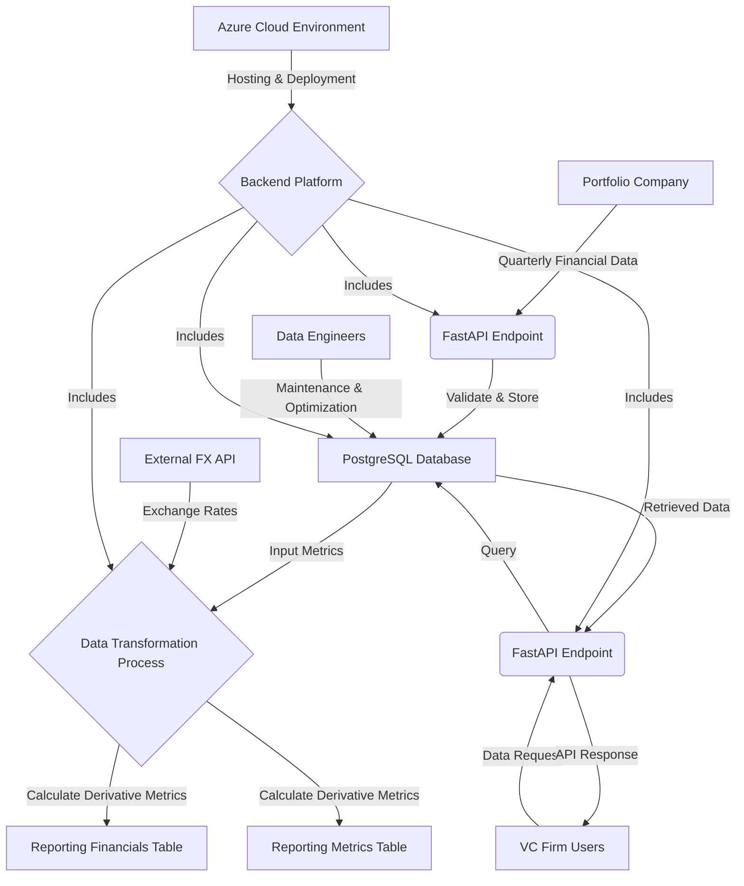
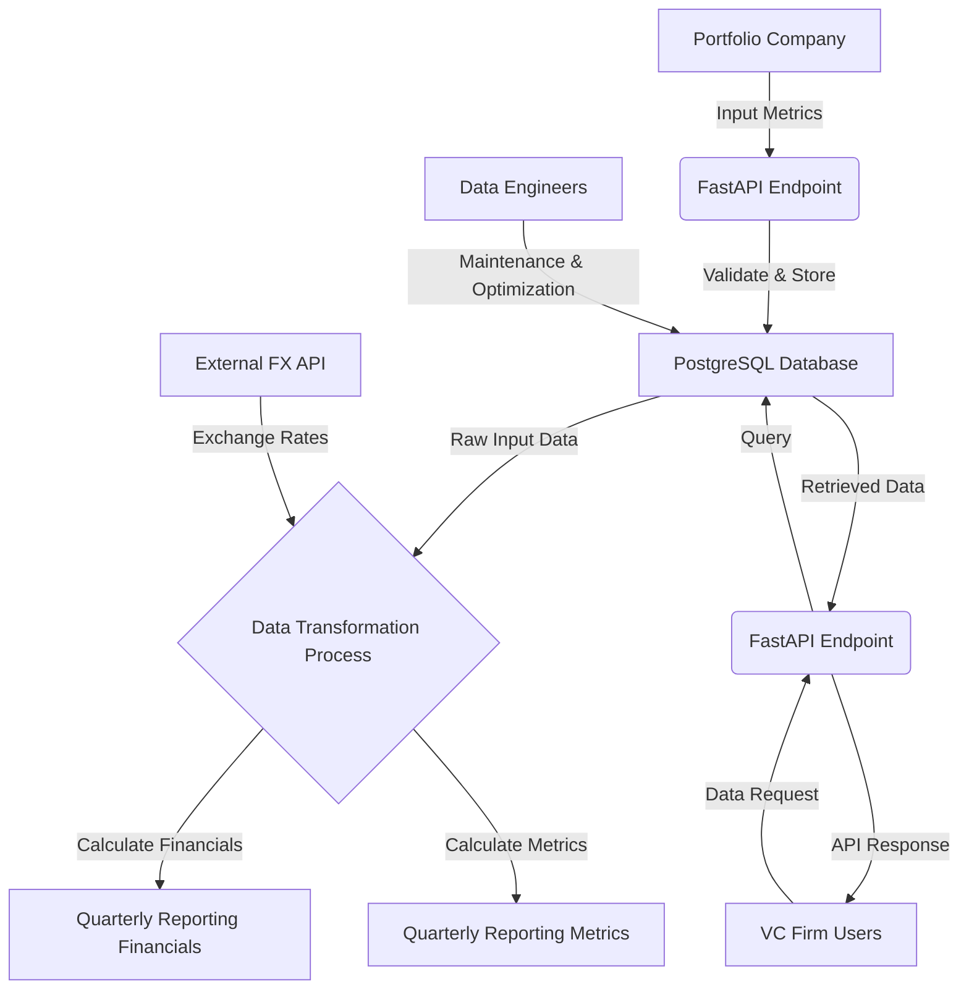

# 1. Introduction

## 1.1 Purpose

The purpose of this Software Requirements Specification (SRS) document is to provide a comprehensive description of the backend platform for storing and retrieving financial reporting metrics from companies in which the VC firm has invested. This document is intended for the following audience:

1. Software developers and engineers responsible for implementing the system
2. Database administrators overseeing the data storage and management
3. Project managers coordinating the development efforts
4. Quality assurance testers validating the system's functionality
5. Stakeholders from the VC firm who will be using the platform

This SRS aims to clearly define the functional and non-functional requirements of the system, ensuring all parties involved have a shared understanding of the project's objectives and specifications.

## 1.2 Scope

The backend platform is designed to efficiently manage and analyze financial data from the VC firm's portfolio companies. The system encompasses the following core functionalities and goals:

1. Data Storage: Implement a PostgreSQL database to store quarterly reporting metrics from invested companies, organized into four main tables: Company Table, Input Metrics, Reporting Financials, and Reporting Metrics.

2. Data Retrieval: Develop a REST API service using FastAPI to facilitate the addition and retrieval of data from the database, ensuring secure and efficient access to financial information.

3. Data Transformation: Create a process to retrieve foreign exchange rates from an external API service and calculate derivative metrics from the input table, populating the reporting financials and metrics tables.

4. Multi-Currency Support: Store and present financial data in local currency, USD, and CAD to enable comprehensive analysis across different markets.

5. Historical Tracking: Maintain a record of data creation and updates, including timestamps and user information, to ensure data integrity and auditability.

6. Scalability: Design the system to accommodate growth in the number of portfolio companies and the volume of financial data over time.

7. Integration: Ensure compatibility with standard Azure products for hosting and deployment.

The primary benefits of this backend platform include:

1. Centralized Data Management: Consolidate financial reporting metrics from multiple portfolio companies into a single, organized system.

2. Improved Decision Making: Provide quick access to up-to-date financial information, enabling more informed investment decisions.

3. Automated Calculations: Reduce manual effort and potential errors by automating the calculation of derivative metrics and currency conversions.

4. Standardized Reporting: Ensure consistency in financial reporting across all portfolio companies, facilitating easier comparison and analysis.

5. Secure Data Handling: Implement robust security measures to protect sensitive financial information.

By delivering these functionalities and benefits, the backend platform will significantly enhance the VC firm's ability to monitor, analyze, and make strategic decisions based on the financial performance of their portfolio companies.

# 2. Product Description

## 2.1 Product Perspective

The backend platform for storing and retrieving financial reporting metrics is a critical component within the larger ecosystem of the VC firm's investment management and analysis infrastructure. This system integrates with existing processes and tools used by the firm to make informed investment decisions and monitor portfolio performance. The platform serves as the central repository for financial data from portfolio companies, enabling various stakeholders to access and analyze this information efficiently.

Key aspects of the product's perspective include:

1. Data Source Integration: The system interfaces with portfolio companies' reporting mechanisms to receive quarterly financial metrics.

2. External API Integration: The platform connects to an external API service to retrieve foreign exchange rates for currency conversions.

3. User Interface Compatibility: While primarily a backend system, it is designed to support future front-end applications that may be developed for data visualization and reporting.

4. Azure Cloud Environment: The platform is built to operate within the Azure cloud ecosystem, leveraging standard Azure products for hosting and deployment.

5. Security Framework: The system adheres to the VC firm's existing security protocols and integrates with their authentication and authorization systems.

## 2.2 Product Functions

The backend platform provides the following key functions:

1. Data Storage and Management:
   - Store quarterly financial metrics from portfolio companies in a PostgreSQL database
   - Organize data into four main tables: Company Table, Input Metrics, Reporting Financials, and Reporting Metrics
   - Maintain historical records of all data entries and updates

2. Data Retrieval and API Services:
   - Provide a REST API using FastAPI for adding and retrieving financial data
   - Support querying of data based on company ID, reporting timeframes, and other relevant parameters

3. Data Transformation and Calculation:
   - Retrieve foreign exchange rates from an external API service
   - Calculate derivative metrics from input data
   - Populate reporting financials and metrics tables with transformed data

4. Multi-Currency Support:
   - Store and present financial data in local currency, USD, and CAD
   - Perform currency conversions using up-to-date exchange rates

5. Data Integrity and Auditing:
   - Track data creation and updates with timestamps and user information
   - Ensure data consistency and accuracy across all tables

6. Scalability and Performance:
   - Handle growing volumes of financial data and increasing numbers of portfolio companies
   - Optimize database queries and API responses for efficient data retrieval

## 2.3 User Characteristics

The backend platform is designed to serve various user groups within the VC firm, each with different needs and levels of technical expertise:

1. Investment Analysts:
   - Expertise: High financial knowledge, moderate technical skills
   - Needs: Quick access to up-to-date financial metrics for analysis and decision-making
   - Interaction: Primarily through data retrieval API endpoints or future front-end applications

2. Portfolio Managers:
   - Expertise: High financial and business knowledge, moderate technical skills
   - Needs: Comprehensive view of portfolio performance and trend analysis
   - Interaction: Through aggregated reports and dashboards supported by the backend

3. Data Engineers:
   - Expertise: High technical skills, database management experience
   - Needs: Direct access to database for maintenance, optimization, and custom queries
   - Interaction: Database management tools and API administration

4. Software Developers:
   - Expertise: High technical skills, API integration experience
   - Needs: Clear API documentation and endpoints for integration with other systems
   - Interaction: API documentation, testing tools, and version control systems

5. Compliance Officers:
   - Expertise: High regulatory knowledge, moderate technical skills
   - Needs: Audit trails and data integrity verification
   - Interaction: Through specialized reporting tools and data logs

## 2.4 Constraints

The backend platform operates under the following constraints:

1. Technical Constraints:
   - Must use PostgreSQL as the database management system
   - API must be developed using FastAPI framework
   - System must be compatible with standard Azure cloud products for hosting and deployment

2. Regulatory Constraints:
   - Must comply with financial data protection regulations and privacy laws
   - Adherence to data retention policies and audit requirements

3. Performance Constraints:
   - API response times must meet specified performance benchmarks
   - Database queries must be optimized to handle large volumes of data efficiently

4. Security Constraints:
   - Implementation of robust encryption for data at rest and in transit
   - Strict access control and authentication mechanisms

5. Scalability Constraints:
   - System must be designed to accommodate growth in data volume and user base without significant architectural changes

6. Integration Constraints:
   - Must integrate seamlessly with existing VC firm systems and potential future front-end applications

7. Data Quality Constraints:
   - Implement validation checks to ensure data accuracy and consistency across all tables

## 2.5 Assumptions and Dependencies

The development and operation of the backend platform are based on the following assumptions and dependencies:

Assumptions:
1. Portfolio companies will provide quarterly financial data in a consistent and timely manner
2. The VC firm will maintain a stable Azure cloud environment for hosting the platform
3. Users will have the necessary permissions and credentials to access the system
4. The external API for foreign exchange rates will remain available and reliable

Dependencies:
1. Availability and reliability of the Azure cloud services for hosting and deployment
2. Continued support and updates for PostgreSQL and FastAPI
3. Stable access to the external foreign exchange rate API service
4. Compatibility with the VC firm's existing security and authentication systems
5. Availability of accurate and up-to-date company information for the Company Table
6. Ongoing maintenance and updates to ensure compatibility with evolving financial reporting standards and regulations

## 2.6 Process Flowchart

The following flowchart illustrates the main processes and data flow within the backend platform:

This flowchart outlines the key processes of the backend platform:

1. Portfolio companies submit quarterly financial data through a FastAPI endpoint.
2. The data is validated and stored in the PostgreSQL database's Input Metrics table.
3. A data transformation process retrieves the input metrics and foreign exchange rates from an external API.
4. The process calculates derivative metrics and populates the Reporting Financials and Reporting Metrics tables.
5. VC firm users can request data through FastAPI endpoints, which query the database and return the information.
6. Data engineers perform maintenance and optimization tasks on the database.
7. The entire backend platform is hosted and deployed within the Azure Cloud environment.

This process ensures efficient data flow, transformation, and retrieval, supporting the VC firm's financial reporting and analysis needs.

# 3. Functional Requirements

## 3.1 Data Storage and Management

### ID
FR-001

### Description
Implement a PostgreSQL database to store and manage quarterly financial metrics from portfolio companies.

### Priority
High

### Table of Functional Requirements

| Requirement ID | Requirement Description |
|----------------|-------------------------|
| FR-001.1 | Create and maintain four main tables: Company Table, Input Metrics, Reporting Financials, and Reporting Metrics |
| FR-001.2 | Implement data validation checks to ensure data integrity and consistency across all tables |
| FR-001.3 | Store historical records of all data entries and updates |
| FR-001.4 | Implement proper indexing and optimization for efficient data retrieval |
| FR-001.5 | Ensure data storage complies with financial data protection regulations and privacy laws |

## 3.2 REST API Service

### ID
FR-002

### Description
Develop a REST API service using FastAPI to facilitate the addition and retrieval of data from the database.

### Priority
High

### Table of Functional Requirements

| Requirement ID | Requirement Description |
|----------------|-------------------------|
| FR-002.1 | Implement GET endpoints for retrieving data from Input Metrics, Reporting Financials, and Reporting Metrics tables |
| FR-002.2 | Implement PUT endpoints for adding and updating data in the Company and Input Metrics tables |
| FR-002.3 | Ensure API endpoints accept and validate required parameters (e.g., company_id, reporting time frame) |
| FR-002.4 | Implement proper error handling and return appropriate HTTP status codes |
| FR-002.5 | Provide API documentation using OpenAPI/Swagger |

## 3.3 Data Transformation Process

### ID
FR-003

### Description
Create a process to retrieve foreign exchange rates and calculate derivative metrics from the input table, populating the reporting financials and metrics tables.

### Priority
High

### Table of Functional Requirements

| Requirement ID | Requirement Description |
|----------------|-------------------------|
| FR-003.1 | Integrate with an external API service to retrieve up-to-date foreign exchange rates |
| FR-003.2 | Implement currency conversion calculations for financial data in local currency, USD, and CAD |
| FR-003.3 | Calculate all derivative metrics as specified in the Quarterly Reporting Metrics table |
| FR-003.4 | Automatically trigger the data transformation process when new input metrics are added |
| FR-003.5 | Ensure accurate calculation of Last Twelve Months (LTM) metrics |

## 3.4 Multi-Currency Support

### ID
FR-004

### Description
Implement multi-currency support to store and present financial data in local currency, USD, and CAD.

### Priority
Medium

### Table of Functional Requirements

| Requirement ID | Requirement Description |
|----------------|-------------------------|
| FR-004.1 | Store exchange rates used for currency conversions in the database |
| FR-004.2 | Implement functionality to update exchange rates periodically |
| FR-004.3 | Ensure all financial metrics are available in local currency, USD, and CAD |
| FR-004.4 | Provide API endpoints to retrieve data in specific currencies |

## 3.5 Historical Tracking and Auditing

### ID
FR-005

### Description
Implement a system to track data creation, updates, and maintain audit trails.

### Priority
Medium

### Table of Functional Requirements

| Requirement ID | Requirement Description |
|----------------|-------------------------|
| FR-005.1 | Record timestamps for data creation and updates in all tables |
| FR-005.2 | Store user information for data creation and updates in all tables |
| FR-005.3 | Implement a logging system to track significant database operations |
| FR-005.4 | Provide API endpoints for retrieving audit information |

## 3.6 Scalability and Performance Optimization

### ID
FR-006

### Description
Ensure the system is designed to handle growing volumes of financial data and increasing numbers of portfolio companies.

### Priority
Medium

### Table of Functional Requirements

| Requirement ID | Requirement Description |
|----------------|-------------------------|
| FR-006.1 | Implement database query optimization techniques |
| FR-006.2 | Design the system to support horizontal scaling |
| FR-006.3 | Implement caching mechanisms for frequently accessed data |
| FR-006.4 | Conduct performance testing and establish performance benchmarks |

## 3.7 Azure Integration

### ID
FR-007

### Description
Ensure compatibility with standard Azure products for hosting and deployment.

### Priority
Medium

### Table of Functional Requirements

| Requirement ID | Requirement Description |
|----------------|-------------------------|
| FR-007.1 | Configure the system for deployment on Azure App Service or Azure Kubernetes Service |
| FR-007.2 | Integrate with Azure Database for PostgreSQL |
| FR-007.3 | Implement Azure Active Directory for authentication and authorization |
| FR-007.4 | Utilize Azure Monitor for system monitoring and logging |

# 4. Non-Functional Requirements

## 4.1 Performance

### NFR-001: API Response Time
- The API must respond to 95% of requests within 500 milliseconds under normal load conditions.
- For complex queries involving multiple tables, the response time should not exceed 2 seconds for 99% of requests.

### NFR-002: Database Query Performance
- Database queries must be optimized to execute within 100 milliseconds for 90% of simple queries.
- Complex queries involving joins and aggregations should complete within 1 second for 95% of cases.

### NFR-003: Concurrent Users
- The system must support at least 100 concurrent API requests without degradation in performance.

### NFR-004: Data Processing
- The data transformation process for calculating derivative metrics must complete within 5 minutes for a single company's quarterly data.

## 4.2 Safety

### NFR-005: Data Backup
- Automated daily backups of the entire database must be performed and stored in a separate Azure storage account.
- The system must be able to restore from a backup within 4 hours in case of data loss or corruption.

### NFR-006: Fault Tolerance
- The system must implement proper error handling to prevent crashes due to unexpected inputs or system failures.
- In case of a component failure, the system must gracefully degrade services while maintaining core functionality.

### NFR-007: Data Integrity
- The system must implement transaction management to ensure data consistency across all tables, especially during the data transformation process.

## 4.3 Security

### NFR-008: Authentication and Authorization
- The system must integrate with Azure Active Directory for user authentication.
- Role-based access control (RBAC) must be implemented to restrict data access based on user roles.

### NFR-009: Data Encryption
- All data at rest must be encrypted using Azure-managed encryption keys.
- All data in transit must be encrypted using TLS 1.2 or higher.

### NFR-010: API Security
- API endpoints must be secured using OAuth 2.0 with JWT tokens.
- Rate limiting must be implemented to prevent API abuse, with a limit of 1000 requests per minute per API key.

### NFR-011: Audit Logging
- All database modifications and API access attempts must be logged with timestamps, user information, and action details.
- Logs must be retained for a minimum of 1 year and be easily searchable for audit purposes.

## 4.4 Quality

### NFR-012: Availability
- The system must maintain 99.9% uptime, excluding scheduled maintenance windows.
- Scheduled maintenance should not exceed 4 hours per month and must be performed during off-peak hours.

### NFR-013: Maintainability
- The codebase must follow PEP 8 style guide for Python code.
- Comprehensive documentation must be maintained for all API endpoints, database schemas, and data transformation processes.

### NFR-014: Usability
- API documentation must be provided using OpenAPI/Swagger specification.
- Error messages returned by the API must be clear, concise, and actionable.

### NFR-015: Scalability
- The system must be designed to handle a 100% increase in data volume and user base within the next two years without significant architectural changes.
- Database and API services must be able to scale horizontally to accommodate increased load.

### NFR-016: Reliability
- The system must have a Mean Time Between Failures (MTBF) of at least 720 hours (30 days).
- The Mean Time To Recover (MTTR) must not exceed 2 hours for any critical system component.

## 4.5 Compliance

### NFR-017: Data Protection Regulations
- The system must comply with GDPR and CCPA regulations for handling personal and financial data.
- Implement mechanisms to support data subject rights, including the right to access, rectify, and erase personal data.

### NFR-018: Financial Reporting Standards
- Ensure that all financial calculations and reporting metrics comply with International Financial Reporting Standards (IFRS) and Generally Accepted Accounting Principles (GAAP).

### NFR-019: Azure Compliance
- The system must adhere to Azure's compliance standards, including ISO 27001 and SOC 2 Type II.

### NFR-020: Audit Trail
- Maintain a complete audit trail of all financial data modifications to comply with financial auditing requirements.
- Ensure the audit trail is tamper-proof and can be easily exported for external auditors.

### NFR-021: Data Retention
- Implement data retention policies in compliance with relevant financial regulations, retaining financial records for a minimum of 7 years.

# 5. Data Requirements

## 5.1 Data Models

The backend platform utilizes a relational database model implemented in PostgreSQL. The data model consists of four main tables: Companies, Metrics Input, Quarterly Reporting Financials, and Quarterly Reporting Metrics. The relationships between these tables are illustrated in the following entity-relationship diagram:

```mermaid
erDiagram
    COMPANIES ||--o{ METRICS_INPUT : "has"
    COMPANIES ||--o{ QUARTERLY_REPORTING_FINANCIALS : "has"
    COMPANIES ||--o{ QUARTERLY_REPORTING_METRICS : "has"
    METRICS_INPUT ||--|{ QUARTERLY_REPORTING_FINANCIALS : "generates"
    METRICS_INPUT ||--|{ QUARTERLY_REPORTING_METRICS : "generates"

    COMPANIES {
        UUID id PK
        string name
        string reporting_status
        string reporting_currency
        string fund
        string location_country
        string customer_type
        string revenue_type
        float equity_raised
        float post_money_valuation
        date year_end_date
        timestamp created_date
        string created_by
        timestamp last_update_date
        string last_updated_by
    }

    METRICS_INPUT {
        UUID id PK
        UUID company_id FK
        string currency
        float total_revenue
        float recurring_revenue
        float gross_profit
        float sales_marketing_expense
        float total_operating_expense
        float ebitda
        float net_income
        float cash_burn
        float cash_balance
        float debt_outstanding
        integer employees
        integer customers
        date fiscal_reporting_date
        integer fiscal_reporting_quarter
        integer reporting_year
        integer reporting_quarter
        timestamp created_date
        string created_by
        timestamp last_update_date
        string last_updated_by
    }

    QUARTERLY_REPORTING_FINANCIALS {
        UUID company_id FK
        string currency
        float exchange_rate_used
        float total_revenue
        float recurring_revenue
        float gross_profit
        float debt_outstanding
        float sales_marketing_expense
        float total_operating_expense
        float ebitda
        float net_income
        float cash_burn
        float cash_balance
        date fiscal_reporting_date
        integer fiscal_reporting_quarter
        integer reporting_year
        integer reporting_quarter
        timestamp created_date
        string created_by
        timestamp last_update_date
        string last_updated_by
    }

    QUARTERLY_REPORTING_METRICS {
        UUID company_id FK
        string currency
        float enterprise_value
        float arr
        float recurring_percentage_revenue
        float revenue_per_fte
        float gross_profit_per_fte
        float employee_growth_rate
        float change_in_cash
        float revenue_growth
        float monthly_cash_burn
        float runway_months
        float ev_by_equity_raised_plus_debt
        float sales_marketing_percentage_revenue
        float total_operating_percentage_revenue
        float gross_profit_margin
        float valuation_to_revenue
        float yoy_growth_revenue
        float yoy_growth_profit
        float yoy_growth_employees
        float yoy_growth_ltm_revenue
        float ltm_total_revenue
        float ltm_gross_profit
        float ltm_sales_marketing_expense
        float ltm_gross_margin
        float ltm_operating_expense
        float ltm_ebitda
        float ltm_net_income
        float ltm_ebitda_margin
        float ltm_net_income_margin
        date fiscal_reporting_date
        integer fiscal_reporting_quarter
        integer reporting_year
        integer reporting_quarter
        timestamp created_date
        string created_by
        timestamp last_update_date
        string last_updated_by
    }
```

## 5.2 Data Storage

### 5.2.1 Database Management System
The backend platform will use PostgreSQL as the primary database management system, hosted on Azure Database for PostgreSQL.

### 5.2.2 Data Retention
- Financial data will be retained for a minimum of 7 years to comply with financial regulations.
- Historical data beyond 7 years will be archived in Azure Blob Storage for long-term retention.

### 5.2.3 Data Redundancy
- Azure Database for PostgreSQL will be configured with geo-redundant storage to ensure data availability across multiple regions.
- Read replicas will be implemented to distribute read operations and improve performance.

### 5.2.4 Backup and Recovery
- Automated daily full backups of the PostgreSQL database will be performed and stored in Azure Backup.
- Point-in-time recovery will be enabled, allowing for restoration to any point within the last 35 days.
- Monthly backups will be retained for 7 years to meet long-term retention requirements.

### 5.2.5 Scalability
- Vertical scaling: Azure Database for PostgreSQL will be configured to automatically scale compute and storage resources based on workload.
- Horizontal scaling: Implementation of database sharding for the Metrics Input and Quarterly Reporting tables to distribute data across multiple servers as the dataset grows.

## 5.3 Data Processing

### 5.3.1 Data Security
- Encryption at rest: All data stored in the PostgreSQL database will be encrypted using Azure-managed keys.
- Encryption in transit: All data transfers will be encrypted using TLS 1.2 or higher.
- Access control: Role-based access control (RBAC) will be implemented to restrict data access based on user roles.
- Data masking: Sensitive financial information will be masked for non-privileged users.

### 5.3.2 Data Flow

The following diagram illustrates the data flow within the backend platform:

### 5.3.3 Data Transformation
- A scheduled Azure Function will trigger the data transformation process daily.
- The process will retrieve new input metrics, perform currency conversions, and calculate derivative metrics.
- Calculated results will be stored in the Quarterly Reporting Financials and Quarterly Reporting Metrics tables.

### 5.3.4 Data Validation
- Input data will be validated against predefined schemas and business rules before storage.
- Automated data quality checks will be performed to ensure consistency and accuracy of calculated metrics.

### 5.3.5 Data Auditing
- All data modifications will be logged with timestamps, user information, and action details.
- An audit trail will be maintained in a separate audit log table within the PostgreSQL database.
- Audit logs will be retained for a minimum of 7 years to comply with financial auditing requirements.

# 6. External Interfaces

## 6.1 User Interfaces

As this is primarily a backend system, there are no direct user interfaces. However, the system should be designed to support future front-end applications. The API documentation, generated using OpenAPI/Swagger, will serve as the primary interface for developers and integrators.

### 6.1.1 API Documentation Interface

The API documentation interface should:

1. Provide a clear and interactive representation of all available endpoints.
2. Allow users to test API calls directly from the documentation.
3. Display request and response schemas for each endpoint.
4. Include authentication requirements and methods.
5. Offer filtering and search capabilities to easily navigate through endpoints.

[Placeholder for API documentation interface mockup]

## 6.2 Hardware Interfaces

As the system is designed to be hosted on Azure cloud services, there are no specific hardware interface requirements. The system will utilize standard cloud infrastructure provided by Azure.

## 6.3 Software Interfaces

The backend platform will interface with several software components:

### 6.3.1 PostgreSQL Database

- Interface Type: Database connection
- Data Format: SQL queries and responses
- Communication Method: PostgreSQL protocol over TLS
- Specific Requirements:
  - Use Azure Database for PostgreSQL
  - Implement connection pooling for efficient resource utilization
  - Ensure proper indexing for optimized query performance

### 6.3.2 External Foreign Exchange Rate API

- Interface Type: RESTful API
- Data Format: JSON
- Communication Method: HTTPS
- Specific Requirements:
  - Implement retry logic with exponential backoff for reliability
  - Cache exchange rates to reduce API calls and improve performance
  - Handle API rate limits and potential downtime gracefully

### 6.3.3 Azure Active Directory

- Interface Type: Authentication and authorization service
- Data Format: OAuth 2.0 tokens
- Communication Method: HTTPS
- Specific Requirements:
  - Integrate with Azure AD for user authentication
  - Implement role-based access control (RBAC) for authorization
  - Use Azure AD B2C for external user management if required

### 6.3.4 Azure Monitor

- Interface Type: Monitoring and logging service
- Data Format: Various (logs, metrics, traces)
- Communication Method: Azure SDK
- Specific Requirements:
  - Implement custom logging for critical operations
  - Set up alerts for performance thresholds and errors
  - Configure Application Insights for detailed performance monitoring

## 6.4 Communication Interfaces

### 6.4.1 RESTful API

- Protocol: HTTPS
- Data Format: JSON
- Port: 443 (standard HTTPS port)
- Specific Requirements:
  - Implement API versioning to support future changes
  - Use JSON Web Tokens (JWT) for API authentication
  - Implement rate limiting to prevent abuse
  - Ensure all endpoints follow RESTful best practices

### 6.4.2 Database Communication

- Protocol: PostgreSQL protocol
- Data Format: SQL
- Port: 5432 (standard PostgreSQL port)
- Specific Requirements:
  - Use TLS 1.2 or higher for encrypted communication
  - Implement connection pooling for efficient resource utilization
  - Use prepared statements to prevent SQL injection attacks

### 6.4.3 Azure Service Bus (for potential future use)

- Protocol: AMQP 1.0
- Data Format: Various (JSON recommended for flexibility)
- Port: 5671 (AMQP over TLS)
- Specific Requirements:
  - Implement for potential future asynchronous processing needs
  - Use topic subscriptions for flexible message routing
  - Implement dead-letter queues for handling failed messages

### 6.4.4 Azure Blob Storage (for data archiving)

- Protocol: HTTPS
- Data Format: Binary (for database backups and archived data)
- Port: 443 (standard HTTPS port)
- Specific Requirements:
  - Implement Shared Access Signatures (SAS) for secure, time-limited access
  - Use Azure Storage SDK for efficient data transfer
  - Configure appropriate retention policies for archived data

All communication interfaces must adhere to the security requirements specified in the Non-Functional Requirements section, including encryption in transit and proper authentication and authorization mechanisms.

# APPENDICES

## A. GLOSSARY

- **Portfolio Company (Portco)**: A company in which the VC firm has invested.
- **Annual Recurring Revenue (ARR)**: The value of the contracted recurring revenue components of term subscriptions normalized to a one-year period.
- **Last Twelve Months (LTM)**: A time frame that refers to the past 12 consecutive months of financial data.
- **Enterprise Value (EV)**: A measure of a company's total value, calculated as the market capitalization plus debt, minority interest and preferred shares, minus total cash and cash equivalents.
- **Runway**: The amount of time a company has before it runs out of cash, assuming current revenue and expense levels.
- **Year-over-Year (YoY) Growth**: The percentage change in a specific metric compared to the same period from the previous year.

## B. ACRONYMS

- **VC**: Venture Capital
- **API**: Application Programming Interface
- **REST**: Representational State Transfer
- **SQL**: Structured Query Language
- **UUID**: Universally Unique Identifier
- **EBITDA**: Earnings Before Interest, Taxes, Depreciation, and Amortization
- **FTE**: Full-Time Equivalent
- **EV**: Enterprise Value
- **SMB**: Small and Medium-sized Business
- **LTM**: Last Twelve Months
- **YoY**: Year-over-Year
- **RBAC**: Role-Based Access Control
- **TLS**: Transport Layer Security
- **JWT**: JSON Web Token
- **AMQP**: Advanced Message Queuing Protocol
- **SAS**: Shared Access Signature

## C. ADDITIONAL REFERENCES

1. PostgreSQL Documentation: https://www.postgresql.org/docs/
2. FastAPI Documentation: https://fastapi.tiangolo.com/
3. Azure Database for PostgreSQL Documentation: https://docs.microsoft.com/en-us/azure/postgresql/
4. Azure Active Directory Documentation: https://docs.microsoft.com/en-us/azure/active-directory/
5. OpenAPI Specification: https://swagger.io/specification/
6. ISO 4217 Currency Codes: https://www.iso.org/iso-4217-currency-codes.html
7. OWASP API Security Top 10: https://owasp.org/www-project-api-security/
8. Azure Monitor Documentation: https://docs.microsoft.com/en-us/azure/azure-monitor/
9. Azure Blob Storage Documentation: https://docs.microsoft.com/en-us/azure/storage/blobs/
10. GDPR Compliance: https://gdpr.eu/
11. CCPA Compliance: https://oag.ca.gov/privacy/ccpa