# 1. Introduction

## 1.1 System Objectives

The primary objective of this backend platform is to create a robust, scalable, and secure system for managing financial reporting metrics from portfolio companies in which the VC firm has invested. The system aims to achieve the following high-level objectives:

1. Centralize Data Management: Consolidate financial reporting metrics from multiple portfolio companies into a single, organized system.

2. Enhance Decision Making: Provide quick access to up-to-date financial information, enabling more informed investment decisions.

3. Automate Calculations: Reduce manual effort and potential errors by automating the calculation of derivative metrics and currency conversions.

4. Standardize Reporting: Ensure consistency in financial reporting across all portfolio companies, facilitating easier comparison and analysis.

5. Ensure Data Security: Implement robust security measures to protect sensitive financial information while maintaining compliance with relevant regulations.

6. Support Scalability: Design the system to accommodate growth in the number of portfolio companies and the volume of financial data over time.

7. Enable Multi-Currency Analysis: Provide the ability to analyze financial data in local currency, USD, and CAD to support global investment strategies.

8. Facilitate Integration: Ensure compatibility with existing VC firm systems and potential future front-end applications.

## 1.2 Scope

The backend platform for storing and retrieving financial reporting metrics encompasses a comprehensive solution designed to meet the specific needs of the VC firm. The scope of this software product includes:

### Goals

1. Develop a centralized database system for storing and managing financial metrics from portfolio companies.
2. Create a RESTful API service for efficient data input and retrieval.
3. Implement automated data transformation processes for currency conversion and metric calculations.
4. Ensure scalability to accommodate future growth in data volume and user base.
5. Maintain high standards of data security and compliance with financial regulations.

### Benefits

1. Improved Efficiency: Streamline the process of collecting, storing, and analyzing financial data from portfolio companies.
2. Enhanced Decision Making: Provide quick access to up-to-date financial metrics, enabling more informed investment decisions.
3. Reduced Error Risk: Minimize manual data entry and calculations, reducing the potential for human error.
4. Standardized Reporting: Ensure consistency in financial reporting across all portfolio companies.
5. Scalable Infrastructure: Support the VC firm's growth with a system designed to handle increasing data volumes and user demands.
6. Multi-Currency Insights: Enable analysis of financial data in multiple currencies for better global market understanding.
7. Audit Readiness: Maintain comprehensive audit trails and data integrity for compliance purposes.

### Core Functionalities

The backend platform will provide the following core functionalities:

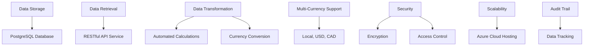

1. Data Storage:
   - Implement a PostgreSQL database to store quarterly reporting metrics from portfolio companies.
   - Organize data into four main tables: Company Table, Input Metrics, Reporting Financials, and Reporting Metrics.

2. Data Retrieval:
   - Develop a RESTful API service using FastAPI for adding and retrieving financial data.
   - Support querying of data based on company ID, reporting timeframes, and other relevant parameters.

3. Data Transformation:
   - Create an automated process to retrieve foreign exchange rates from an external API service.
   - Implement calculations for derivative metrics from input data to populate reporting financials and metrics tables.

4. Multi-Currency Support:
   - Store and present financial data in local currency, USD, and CAD.
   - Perform currency conversions using up-to-date exchange rates.

5. Security and Compliance:
   - Implement robust encryption for data at rest and in transit.
   - Ensure compliance with financial data protection regulations and privacy laws.
   - Implement role-based access control (RBAC) for data access.

6. Scalability and Performance:
   - Design the system to handle growing volumes of financial data and increasing numbers of portfolio companies.
   - Optimize database queries and API responses for efficient data retrieval.

7. Audit Trail and Data Integrity:
   - Maintain historical records of all data entries and updates.
   - Implement data validation checks to ensure data consistency and accuracy across all tables.

8. Azure Integration:
   - Ensure compatibility with standard Azure products for hosting and deployment.
   - Utilize Azure services for database management, authentication, and monitoring.

By delivering these core functionalities, the backend platform will significantly enhance the VC firm's ability to monitor, analyze, and make strategic decisions based on the financial performance of their portfolio companies.

Here's a breakdown of the product into features, maintaining consistency with the previous technology and framework choices in the document:

## 1. Data Storage and Management

### ID
F-001

### DESCRIPTION
Implement a robust PostgreSQL database system to store and manage financial reporting metrics from portfolio companies.

### PRIORITY
High

### TABLE OF TECHNICAL REQUIREMENTS

| Requirement ID | Requirement Description |
|----------------|-------------------------|
| TR-001.1 | Implement PostgreSQL database with four main tables: Company, Input Metrics, Reporting Financials, and Reporting Metrics |
| TR-001.2 | Configure Azure Database for PostgreSQL with geo-redundant storage |
| TR-001.3 | Implement data validation checks to ensure data integrity across all tables |
| TR-001.4 | Set up automated daily backups using Azure Backup |
| TR-001.5 | Configure point-in-time recovery for the last 35 days |
| TR-001.6 | Implement database sharding for Metrics Input and Quarterly Reporting tables |

## 2. REST API Service

### ID
F-002

### DESCRIPTION
Develop a comprehensive REST API service using FastAPI to facilitate data input and retrieval from the database.

### PRIORITY
High

### TABLE OF TECHNICAL REQUIREMENTS

| Requirement ID | Requirement Description |
|----------------|-------------------------|
| TR-002.1 | Implement FastAPI framework for creating RESTful API endpoints |
| TR-002.2 | Develop GET endpoints for retrieving data from all tables |
| TR-002.3 | Implement PUT endpoints for adding and updating data in Company and Input Metrics tables |
| TR-002.4 | Integrate Azure Active Directory for API authentication |
| TR-002.5 | Implement rate limiting to prevent API abuse |
| TR-002.6 | Generate OpenAPI/Swagger documentation for all API endpoints |

## 3. Data Transformation Process

### ID
F-003

### DESCRIPTION
Create an automated process to retrieve foreign exchange rates and calculate derivative metrics from input data.

### PRIORITY
High

### TABLE OF TECHNICAL REQUIREMENTS

| Requirement ID | Requirement Description |
|----------------|-------------------------|
| TR-003.1 | Develop an Azure Function to trigger daily data transformation process |
| TR-003.2 | Integrate with external API for retrieving up-to-date foreign exchange rates |
| TR-003.3 | Implement currency conversion calculations for local currency, USD, and CAD |
| TR-003.4 | Develop algorithms to calculate all derivative metrics as specified |
| TR-003.5 | Implement error handling and logging for the transformation process |
| TR-003.6 | Optimize the process to complete within 5 minutes for a single company's quarterly data |

## 4. Multi-Currency Support

### ID
F-004

### DESCRIPTION
Implement a system to store and present financial data in multiple currencies (local, USD, and CAD).

### PRIORITY
Medium

### TABLE OF TECHNICAL REQUIREMENTS

| Requirement ID | Requirement Description |
|----------------|-------------------------|
| TR-004.1 | Design database schema to store financial data in multiple currencies |
| TR-004.2 | Implement functionality to update exchange rates periodically |
| TR-004.3 | Develop API endpoints to retrieve data in specific currencies |
| TR-004.4 | Implement caching mechanism for frequently used exchange rates |
| TR-004.5 | Ensure accurate currency conversion in all financial calculations |

## 5. Security and Compliance

### ID
F-005

### DESCRIPTION
Implement robust security measures and ensure compliance with financial data protection regulations.

### PRIORITY
High

### TABLE OF TECHNICAL REQUIREMENTS

| Requirement ID | Requirement Description |
|----------------|-------------------------|
| TR-005.1 | Implement encryption at rest using Azure-managed keys |
| TR-005.2 | Configure TLS 1.2 or higher for all data in transit |
| TR-005.3 | Integrate with Azure Active Directory for authentication and authorization |
| TR-005.4 | Implement role-based access control (RBAC) for data access |
| TR-005.5 | Develop comprehensive audit logging system |
| TR-005.6 | Ensure compliance with GDPR and CCPA regulations |
| TR-005.7 | Implement data retention policies in line with financial regulations |

## 6. Scalability and Performance Optimization

### ID
F-006

### DESCRIPTION
Ensure the system is designed to handle growing volumes of financial data and increasing numbers of portfolio companies.

### PRIORITY
Medium

### TABLE OF TECHNICAL REQUIREMENTS

| Requirement ID | Requirement Description |
|----------------|-------------------------|
| TR-006.1 | Configure Azure Database for PostgreSQL for automatic vertical scaling |
| TR-006.2 | Implement database query optimization techniques |
| TR-006.3 | Set up read replicas for distributing read operations |
| TR-006.4 | Implement caching mechanisms for frequently accessed data |
| TR-006.5 | Optimize API response times to meet performance benchmarks |
| TR-006.6 | Conduct regular performance testing and establish benchmarks |

## 7. Monitoring and Logging

### ID
F-007

### DESCRIPTION
Implement comprehensive monitoring and logging systems to ensure system health and facilitate troubleshooting.

### PRIORITY
Medium

### TABLE OF TECHNICAL REQUIREMENTS

| Requirement ID | Requirement Description |
|----------------|-------------------------|
| TR-007.1 | Integrate with Azure Monitor for system-wide monitoring |
| TR-007.2 | Set up Application Insights for detailed performance monitoring |
| TR-007.3 | Implement custom logging for critical operations |
| TR-007.4 | Configure alerts for performance thresholds and errors |
| TR-007.5 | Develop a dashboard for real-time system health visualization |
| TR-007.6 | Implement log retention policies in compliance with regulations |

## 8. Data Archiving and Retention

### ID
F-008

### DESCRIPTION
Implement a system for long-term data archiving and retention to comply with financial regulations and optimize system performance.

### PRIORITY
Low

### TABLE OF TECHNICAL REQUIREMENTS

| Requirement ID | Requirement Description |
|----------------|-------------------------|
| TR-008.1 | Develop a process to archive historical data older than 7 years |
| TR-008.2 | Integrate with Azure Blob Storage for long-term data retention |
| TR-008.3 | Implement Shared Access Signatures (SAS) for secure access to archived data |
| TR-008.4 | Develop a retrieval process for archived data when needed |
| TR-008.5 | Ensure archived data is encrypted and compliant with data protection regulations |
| TR-008.6 | Implement a system to manage and track data retention periods |

# 2. SYSTEM ARCHITECTURE

The backend platform for storing and retrieving financial reporting metrics is designed as a modular, scalable, and secure system leveraging Azure cloud services. This section outlines the high-level architecture, key components, and their interactions.

## 2.1 High-Level System Architecture

The following diagram provides an overview of the system's components and their interactions:

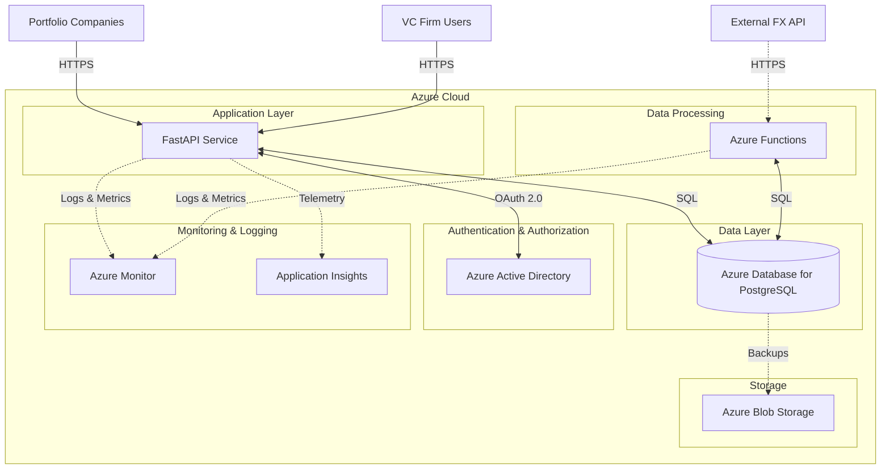

## 2.2 Component Description

### 2.2.1 Application Layer

The application layer consists of a FastAPI service that handles incoming requests, processes data, and interacts with other components of the system.

Key features:
- RESTful API endpoints for data input and retrieval
- Request validation and error handling
- Integration with Azure Active Directory for authentication and authorization
- Business logic implementation for data processing and transformation

### 2.2.2 Data Layer

Azure Database for PostgreSQL serves as the primary data store for the system, hosting the four main tables: Companies, Metrics Input, Quarterly Reporting Financials, and Quarterly Reporting Metrics.

Key features:
- Geo-redundant storage for high availability
- Automated backups and point-in-time recovery
- Scalable performance with automatic vertical scaling
- Encryption at rest and in transit

### 2.2.3 Authentication & Authorization

Azure Active Directory (AAD) is used to manage user authentication and authorization, ensuring secure access to the system.

Key features:
- OAuth 2.0 and OpenID Connect support
- Role-Based Access Control (RBAC) implementation
- Integration with FastAPI for seamless authentication flow
- Support for multi-factor authentication

### 2.2.4 Monitoring & Logging

Azure Monitor and Application Insights are utilized for comprehensive monitoring, logging, and alerting.

Key features:
- Real-time performance monitoring
- Custom log analytics
- Automated alerting based on predefined thresholds
- Application performance management

### 2.2.5 Data Processing

Azure Functions are employed for background processing tasks, such as data transformation and currency conversion.

Key features:
- Serverless compute for cost-effective processing
- Scheduled execution for regular data updates
- Integration with external FX API for currency conversion
- Scalable processing capacity based on workload

### 2.2.6 Storage

Azure Blob Storage is used for long-term data archiving and database backups.

Key features:
- Secure and durable object storage
- Tiered storage for cost optimization
- Integration with Azure Database for PostgreSQL for automated backups
- Shared Access Signatures (SAS) for secure, time-limited access

## 2.3 Data Flow

The following diagram illustrates the primary data flows within the system:

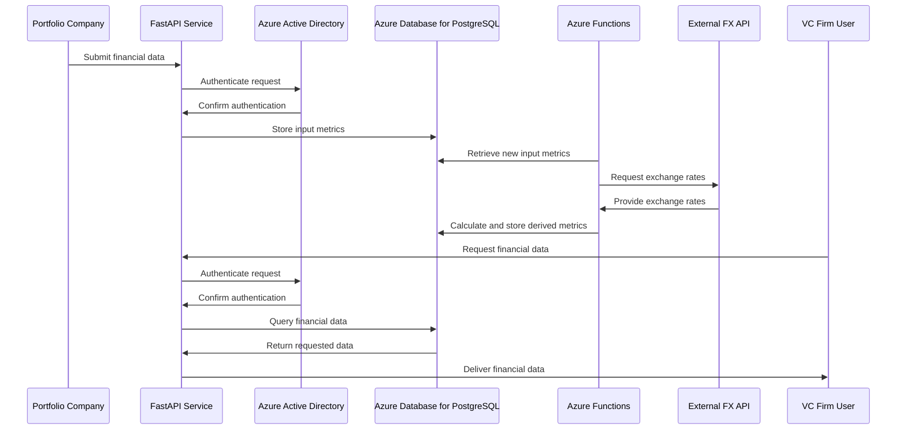

## 2.4 Scalability and Performance Considerations

The system architecture is designed to be scalable and performant:

1. **Database Scalability**: Azure Database for PostgreSQL can be vertically scaled to handle increased load. For further scalability, database sharding can be implemented for the Metrics Input and Quarterly Reporting tables.

2. **Application Layer Scaling**: The FastAPI service can be deployed to Azure App Service or Azure Kubernetes Service, allowing for horizontal scaling to handle increased request volume.

3. **Caching**: Implement Azure Redis Cache for frequently accessed data to reduce database load and improve response times.

4. **Read Replicas**: Utilize read replicas in Azure Database for PostgreSQL to distribute read operations and improve query performance.

5. **Asynchronous Processing**: Use Azure Functions for background processing to ensure the main application remains responsive during computationally intensive tasks.

## 2.5 Security Architecture

The system implements a multi-layered security approach:

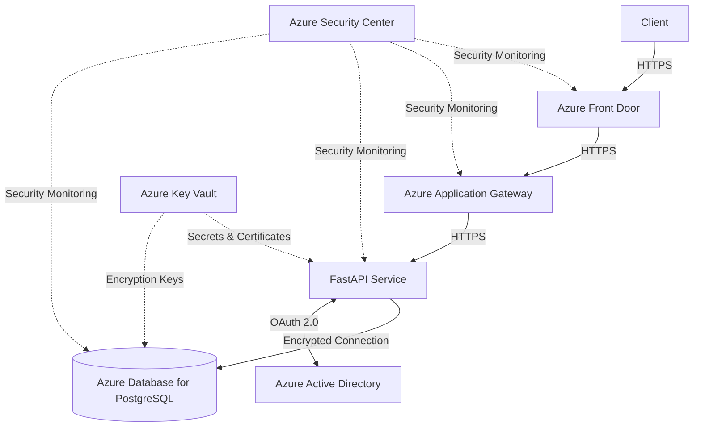

Key security features:
- End-to-end encryption using HTTPS
- Azure Front Door and Application Gateway for DDoS protection and Web Application Firewall (WAF)
- Azure Active Directory for robust authentication and authorization
- Azure Key Vault for secure management of secrets and encryption keys
- Azure Security Center for continuous security monitoring and threat protection

This architecture ensures a secure, scalable, and performant system that meets the requirements for storing and retrieving financial reporting metrics for the VC firm.

# 3. SYSTEM COMPONENTS ARCHITECTURE

## 3.1 COMPONENT DIAGRAMS

The backend platform for storing and retrieving financial reporting metrics consists of several interconnected components. The following diagram illustrates the main components and their relationships:

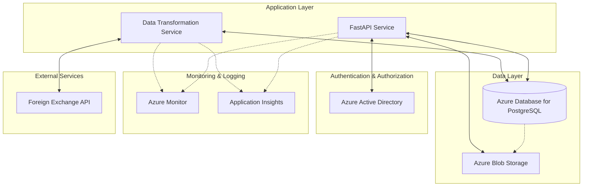

### Component Descriptions:

1. **FastAPI Service**: The main application component that handles API requests, data validation, and business logic.
2. **Data Transformation Service**: An Azure Function that processes input data, performs currency conversions, and calculates derived metrics.
3. **Azure Database for PostgreSQL**: The primary data store for all financial metrics and company information.
4. **Azure Blob Storage**: Used for long-term data archiving and storing database backups.
5. **Azure Active Directory**: Manages authentication and authorization for the system.
6. **Azure Monitor & Application Insights**: Provides monitoring, logging, and performance tracking for the entire system.
7. **Foreign Exchange API**: An external service used to retrieve current exchange rates for currency conversions.

## 3.2 SEQUENCE DIAGRAMS

### 3.2.1 Data Input Sequence

The following sequence diagram illustrates the process of inputting new financial data into the system:

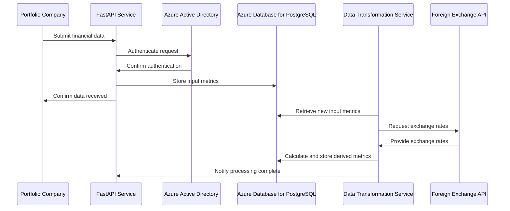

### 3.2.2 Data Retrieval Sequence

This sequence diagram shows the process of retrieving financial data from the system:

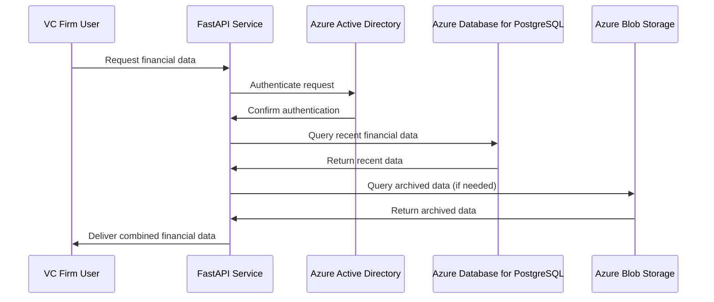

## 3.3 DATA-FLOW DIAGRAM

The following data-flow diagram explains how information moves through the system:

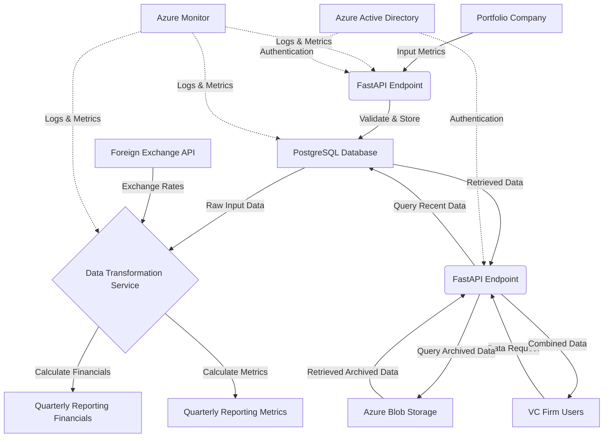

### Data Flow Description:

1. Portfolio companies submit financial data through the FastAPI endpoint.
2. The FastAPI service validates the data and stores it in the PostgreSQL database.
3. The Data Transformation Service retrieves new input data from the database.
4. Exchange rates are fetched from the Foreign Exchange API.
5. The Data Transformation Service calculates derived metrics and financials.
6. Calculated data is stored in the Quarterly Reporting Financials and Metrics tables.
7. VC Firm users request financial data through the FastAPI endpoint.
8. The API queries recent data from the PostgreSQL database and archived data from Azure Blob Storage if needed.
9. Combined data is delivered to the VC Firm users.
10. Azure Monitor collects logs and metrics from all components.
11. Azure Active Directory handles authentication for all user interactions.

This data flow ensures efficient processing of financial data, from input to transformation and retrieval, while maintaining security and monitoring throughout the system.

# 3. SYSTEM DESIGN

## 3.1 PROGRAMMING LANGUAGES

The backend platform will primarily use the following programming languages:

| Language | Purpose | Justification |
|----------|---------|---------------|
| Python 3.9+ | Main backend language | - FastAPI is built on Python, providing high performance and easy-to-use async capabilities<br>- Extensive libraries for data processing and analysis<br>- Strong community support and ecosystem<br>- Excellent integration with Azure services |
| SQL | Database queries and management | - Native language for PostgreSQL database<br>- Efficient for complex data operations and joins<br>- Widely used and understood in the industry |
| JavaScript | API documentation (Swagger UI) | - Required for interactive API documentation<br>- Enhances developer experience when exploring API endpoints |

## 3.2 DATABASE DESIGN

The system will use Azure Database for PostgreSQL as the primary data store. The database design consists of four main tables, as outlined in the data model section. Here's a more detailed look at the table structures:

### 3.2.1 Companies Table

```sql
CREATE TABLE Companies (
    id UUID PRIMARY KEY,
    name VARCHAR(255) NOT NULL,
    reporting_status VARCHAR(50) NOT NULL,
    reporting_currency CHAR(3) NOT NULL,
    fund VARCHAR(100) NOT NULL,
    location_country VARCHAR(100) NOT NULL,
    customer_type VARCHAR(50) NOT NULL,
    revenue_type VARCHAR(50) NOT NULL,
    equity_raised DECIMAL(15, 2),
    post_money_valuation DECIMAL(15, 2),
    year_end_date DATE NOT NULL,
    created_date TIMESTAMP WITH TIME ZONE DEFAULT CURRENT_TIMESTAMP,
    created_by VARCHAR(100) NOT NULL,
    last_update_date TIMESTAMP WITH TIME ZONE,
    last_updated_by VARCHAR(100)
);
```

### 3.2.2 Metrics Input Table

```sql
CREATE TABLE Metrics_Input (
    id UUID PRIMARY KEY,
    company_id UUID REFERENCES Companies(id),
    currency CHAR(3) NOT NULL,
    total_revenue DECIMAL(15, 2) NOT NULL,
    recurring_revenue DECIMAL(15, 2) NOT NULL,
    gross_profit DECIMAL(15, 2) NOT NULL,
    sales_marketing_expense DECIMAL(15, 2) NOT NULL,
    total_operating_expense DECIMAL(15, 2) NOT NULL,
    ebitda DECIMAL(15, 2) NOT NULL,
    net_income DECIMAL(15, 2) NOT NULL,
    cash_burn DECIMAL(15, 2) NOT NULL,
    cash_balance DECIMAL(15, 2) NOT NULL,
    debt_outstanding DECIMAL(15, 2),
    employees INTEGER NOT NULL,
    customers INTEGER,
    fiscal_reporting_date DATE NOT NULL,
    fiscal_reporting_quarter INTEGER NOT NULL,
    reporting_year INTEGER NOT NULL,
    reporting_quarter INTEGER NOT NULL,
    created_date TIMESTAMP WITH TIME ZONE DEFAULT CURRENT_TIMESTAMP,
    created_by VARCHAR(100) NOT NULL,
    last_update_date TIMESTAMP WITH TIME ZONE,
    last_updated_by VARCHAR(100)
);
```

### 3.2.3 Quarterly Reporting Financials Table

```sql
CREATE TABLE Quarterly_Reporting_Financials (
    company_id UUID REFERENCES Companies(id),
    currency CHAR(3) NOT NULL,
    exchange_rate_used DECIMAL(10, 6) NOT NULL,
    total_revenue DECIMAL(15, 2) NOT NULL,
    recurring_revenue DECIMAL(15, 2) NOT NULL,
    gross_profit DECIMAL(15, 2) NOT NULL,
    debt_outstanding DECIMAL(15, 2),
    sales_marketing_expense DECIMAL(15, 2) NOT NULL,
    total_operating_expense DECIMAL(15, 2) NOT NULL,
    ebitda DECIMAL(15, 2) NOT NULL,
    net_income DECIMAL(15, 2) NOT NULL,
    cash_burn DECIMAL(15, 2) NOT NULL,
    cash_balance DECIMAL(15, 2) NOT NULL,
    fiscal_reporting_date DATE NOT NULL,
    fiscal_reporting_quarter INTEGER NOT NULL,
    reporting_year INTEGER NOT NULL,
    reporting_quarter INTEGER NOT NULL,
    created_date TIMESTAMP WITH TIME ZONE DEFAULT CURRENT_TIMESTAMP,
    created_by VARCHAR(100) NOT NULL,
    last_update_date TIMESTAMP WITH TIME ZONE,
    last_updated_by VARCHAR(100),
    PRIMARY KEY (company_id, currency, fiscal_reporting_date)
);
```

### 3.2.4 Quarterly Reporting Metrics Table

```sql
CREATE TABLE Quarterly_Reporting_Metrics (
    company_id UUID REFERENCES Companies(id),
    currency CHAR(3) NOT NULL,
    enterprise_value DECIMAL(15, 2),
    arr DECIMAL(15, 2),
    recurring_percentage_revenue DECIMAL(5, 2),
    revenue_per_fte DECIMAL(15, 2),
    gross_profit_per_fte DECIMAL(15, 2),
    employee_growth_rate DECIMAL(5, 2),
    change_in_cash DECIMAL(15, 2),
    revenue_growth DECIMAL(5, 2),
    monthly_cash_burn DECIMAL(15, 2),
    runway_months DECIMAL(5, 1),
    ev_by_equity_raised_plus_debt DECIMAL(5, 2),
    sales_marketing_percentage_revenue DECIMAL(5, 2),
    total_operating_percentage_revenue DECIMAL(5, 2),
    gross_profit_margin DECIMAL(5, 2),
    valuation_to_revenue DECIMAL(5, 2),
    yoy_growth_revenue DECIMAL(5, 2),
    yoy_growth_profit DECIMAL(5, 2),
    yoy_growth_employees DECIMAL(5, 2),
    yoy_growth_ltm_revenue DECIMAL(5, 2),
    ltm_total_revenue DECIMAL(15, 2),
    ltm_gross_profit DECIMAL(15, 2),
    ltm_sales_marketing_expense DECIMAL(15, 2),
    ltm_gross_margin DECIMAL(5, 2),
    ltm_operating_expense DECIMAL(15, 2),
    ltm_ebitda DECIMAL(15, 2),
    ltm_net_income DECIMAL(15, 2),
    ltm_ebitda_margin DECIMAL(5, 2),
    ltm_net_income_margin DECIMAL(5, 2),
    fiscal_reporting_date DATE NOT NULL,
    fiscal_reporting_quarter INTEGER NOT NULL,
    reporting_year INTEGER NOT NULL,
    reporting_quarter INTEGER NOT NULL,
    created_date TIMESTAMP WITH TIME ZONE DEFAULT CURRENT_TIMESTAMP,
    created_by VARCHAR(100) NOT NULL,
    last_update_date TIMESTAMP WITH TIME ZONE,
    last_updated_by VARCHAR(100),
    PRIMARY KEY (company_id, currency, fiscal_reporting_date)
);
```

### 3.2.5 Indexing Strategy

To optimize query performance, the following indexes will be created:

```sql
CREATE INDEX idx_companies_name ON Companies(name);
CREATE INDEX idx_metrics_input_company_date ON Metrics_Input(company_id, fiscal_reporting_date);
CREATE INDEX idx_quarterly_financials_company_date ON Quarterly_Reporting_Financials(company_id, fiscal_reporting_date);
CREATE INDEX idx_quarterly_metrics_company_date ON Quarterly_Reporting_Metrics(company_id, fiscal_reporting_date);
```

## 3.3 API DESIGN

The API will be designed using RESTful principles and implemented using FastAPI. The main endpoints will be:

### 3.3.1 Companies Endpoints

```mermaid
graph TD
    A[Companies API] --> B[GET /companies]
    A --> C[GET /companies/{company_id}]
    A --> D[PUT /companies/{company_id}]
    A --> E[POST /companies]
```

- `GET /companies`: Retrieve a list of all companies
- `GET /companies/{company_id}`: Retrieve details of a specific company
- `PUT /companies/{company_id}`: Update company information
- `POST /companies`: Create a new company

### 3.3.2 Metrics Input Endpoints

```mermaid
graph TD
    A[Metrics Input API] --> B[GET /metrics/input]
    A --> C[GET /metrics/input/{company_id}]
    A --> D[POST /metrics/input]
    A --> E[PUT /metrics/input/{id}]
```

- `GET /metrics/input`: Retrieve all input metrics (with filtering options)
- `GET /metrics/input/{company_id}`: Retrieve input metrics for a specific company
- `POST /metrics/input`: Submit new input metrics
- `PUT /metrics/input/{id}`: Update existing input metrics

### 3.3.3 Reporting Financials Endpoints

```mermaid
graph TD
    A[Reporting Financials API] --> B[GET /financials]
    A --> C[GET /financials/{company_id}]
```

- `GET /financials`: Retrieve all reporting financials (with filtering options)
- `GET /financials/{company_id}`: Retrieve reporting financials for a specific company

### 3.3.4 Reporting Metrics Endpoints

```mermaid
graph TD
    A[Reporting Metrics API] --> B[GET /metrics]
    A --> C[GET /metrics/{company_id}]
```

- `GET /metrics`: Retrieve all reporting metrics (with filtering options)
- `GET /metrics/{company_id}`: Retrieve reporting metrics for a specific company

### 3.3.5 API Authentication and Authorization

The API will use Azure Active Directory for authentication and implement OAuth 2.0 with JWT tokens. Role-based access control (RBAC) will be implemented to ensure proper authorization for different user roles.

### 3.3.6 API Versioning

API versioning will be implemented to ensure backward compatibility as the system evolves. The version will be included in the URL path:

```
https://api.example.com/v1/companies
```

### 3.3.7 Error Handling

The API will use standard HTTP status codes and return detailed error messages in a consistent JSON format:

```json
{
  "error": {
    "code": "INVALID_INPUT",
    "message": "The provided input is invalid.",
    "details": [
      {
        "field": "total_revenue",
        "issue": "Must be a positive number"
      }
    ]
  }
}
```

### 3.3.8 Rate Limiting

To prevent API abuse, rate limiting will be implemented using the following headers:

```
X-RateLimit-Limit: 1000
X-RateLimit-Remaining: 999
X-RateLimit-Reset: 1623456789
```

This API design ensures a consistent, secure, and scalable interface for interacting with the financial reporting metrics system, aligning with the overall architecture and requirements of the project.

# 7. USER INTERFACE DESIGN

While the backend platform primarily focuses on data storage, processing, and API services, it is essential to consider the user interface design for potential front-end applications that will interact with this system. This section outlines the key user interfaces that could be developed to leverage the backend platform's capabilities.

## 7.1 API Documentation Interface

The API documentation interface will be the primary point of interaction for developers and integrators. It will be generated using OpenAPI/Swagger and should provide a clear, interactive representation of all available endpoints.

### 7.1.1 Layout

```
+-------------------------------------------------------+
|                   API Documentation                   |
+-------------------------------------------------------+
| Endpoints | Models | Authentication | Settings        |
+-------------------------------------------------------+
|                                                       |
| GET /companies                                        |
| +-------------------------------------------------+   |
| | Description                                     |   |
| | Parameters                                      |   |
| | Responses                                       |   |
| | Try it out                                      |   |
| +-------------------------------------------------+   |
|                                                       |
| POST /metrics/input                                   |
| +-------------------------------------------------+   |
| | Description                                     |   |
| | Parameters                                      |   |
| | Request Body                                    |   |
| | Responses                                       |   |
| | Try it out                                      |   |
| +-------------------------------------------------+   |
|                                                       |
+-------------------------------------------------------+
```

### 7.1.2 Functionality

- Interactive endpoint testing
- Authentication token management
- Schema visualization for request and response bodies
- Filtering and search capabilities for endpoints
- Syntax highlighting for code examples

## 7.2 Dashboard Interface

A dashboard interface could be developed to provide VC firm users with a high-level overview of portfolio company performance.

### 7.2.1 Layout

```
+-------------------------------------------------------+
|        Portfolio Performance Dashboard                |
+-------------------------------------------------------+
| Company Filter | Date Range | Metrics | Export        |
+-------------------------------------------------------+
|                |                                      |
| Key Metrics    |  Performance Charts                  |
| +----------+   |  +--------------------------------+  |
| | ARR      |   |  |                                |  |
| | Growth   |   |  |    Revenue Growth Chart        |  |
| | Runway   |   |  |                                |  |
| | ...      |   |  +--------------------------------+  |
| +----------+   |                                      |
|                |  +--------------------------------+  |
| Company List   |  |                                |  |
| +----------+   |  |    Burn Rate Chart             |  |
| | Company A |   |  |                                |  |
| | Company B |   |  +--------------------------------+  |
| | ...      |   |                                      |
| +----------+   |                                      |
|                |                                      |
+-------------------------------------------------------+
```

### 7.2.2 Functionality

- Interactive filtering by company, fund, or custom criteria
- Date range selection for historical data viewing
- Dynamic chart generation based on selected metrics
- Export functionality for reports and raw data
- Drill-down capability for detailed company views

## 7.3 Data Input Interface

An interface for portfolio companies to submit their financial data could streamline the data collection process.

### 7.3.1 Layout

```
+-------------------------------------------------------+
|               Financial Data Submission               |
+-------------------------------------------------------+
| Company: [Dropdown]  Reporting Period: [Date Picker]  |
+-------------------------------------------------------+
|                                                       |
| +---------------------------------------------------+ |
| |                  Input Form                       | |
| | +---------------------+ +---------------------+   | |
| | | Total Revenue       | | Recurring Revenue   |   | |
| | +---------------------+ +---------------------+   | |
| | +---------------------+ +---------------------+   | |
| | | Gross Profit        | | Operating Expenses  |   | |
| | +---------------------+ +---------------------+   | |
| | ...                                               | |
| +---------------------------------------------------+ |
|                                                       |
| [Save Draft]                    [Submit]              |
+-------------------------------------------------------+
```

### 7.3.2 Functionality

- Company-specific form generation based on required metrics
- Data validation to ensure completeness and accuracy
- Draft saving functionality for partial completion
- Historical data view for reference
- Confirmation and error messaging

## 7.4 Analytics Interface

An advanced analytics interface could provide deeper insights into portfolio performance and trends.

### 7.4.1 Layout

```
+-------------------------------------------------------+
|                 Portfolio Analytics                   |
+-------------------------------------------------------+
| Metrics | Comparisons | Forecasts | Custom Reports    |
+-------------------------------------------------------+
|                                                       |
| +-------------------+  +----------------------------+ |
| |                   |  |                            | |
| | Metric Selection  |  |  Data Visualization Area   | |
| |                   |  |                            | |
| | [ ] Revenue       |  |  (Charts, Graphs, Tables)  | |
| | [ ] Gross Margin  |  |                            | |
| | [ ] Burn Rate     |  |                            | |
| | ...               |  |                            | |
| |                   |  |                            | |
| +-------------------+  +----------------------------+ |
|                                                       |
| +-----------------------------------------------+     |
| |              Analysis Controls                |     |
| | Time Period | Grouping | Calculation Method   |     |
| +-----------------------------------------------+     |
|                                                       |
+-------------------------------------------------------+
```

### 7.4.2 Functionality

- Flexible metric selection and combination
- Advanced data visualization options (line charts, bar graphs, scatter plots, etc.)
- Comparative analysis between companies or against benchmarks
- Forecasting tools using historical data and growth trends
- Custom report generation with export capabilities

## 7.5 User Management Interface

An interface for managing user access and permissions within the system.

### 7.5.1 Layout

```
+-------------------------------------------------------+
|                  User Management                      |
+-------------------------------------------------------+
| Users | Roles | Permissions | Audit Log               |
+-------------------------------------------------------+
|                                                       |
| +-------------------+  +----------------------------+ |
| | User List         |  | User Details               | |
| |                   |  |                            | |
| | - John Doe        |  | Name: John Doe             | |
| | - Jane Smith      |  | Email: john@example.com    | |
| | - ...             |  | Role: Analyst              | |
| |                   |  |                            | |
| | [Add User]        |  | Permissions:               | |
| |                   |  | [ ] View Companies         | |
| |                   |  | [ ] Edit Metrics           | |
| |                   |  | [ ] Generate Reports       | |
| |                   |  | ...                        | |
| |                   |  |                            | |
| |                   |  | [Save Changes]             | |
| +-------------------+  +----------------------------+ |
|                                                       |
+-------------------------------------------------------+
```

### 7.5.2 Functionality

- User creation, editing, and deactivation
- Role assignment and custom permission configuration
- Integration with Azure Active Directory for SSO
- Audit logging of user management activities
- Bulk user import/export capabilities

These user interface designs provide a foundation for building comprehensive front-end applications that leverage the backend platform's capabilities. The actual implementation may vary based on specific requirements and user feedback, but these designs ensure consistency with the backend architecture and provide a user-friendly way to interact with the financial reporting metrics system.

# TECHNOLOGY STACK

## PROGRAMMING LANGUAGES

The backend platform will primarily use the following programming languages:

| Language | Purpose | Justification |
|----------|---------|---------------|
| Python 3.9+ | Main backend language | - FastAPI is built on Python, providing high performance and easy-to-use async capabilities<br>- Extensive libraries for data processing and analysis<br>- Strong community support and ecosystem<br>- Excellent integration with Azure services |
| SQL | Database queries and management | - Native language for PostgreSQL database<br>- Efficient for complex data operations and joins<br>- Widely used and understood in the industry |
| JavaScript | API documentation (Swagger UI) | - Required for interactive API documentation<br>- Enhances developer experience when exploring API endpoints |

## FRAMEWORKS AND LIBRARIES

The following frameworks and libraries will be utilized in the development of the backend platform:

| Framework/Library | Purpose | Justification |
|-------------------|---------|---------------|
| FastAPI | Web framework for building APIs | - High performance, on par with NodeJS and Go<br>- Built-in support for async operations<br>- Automatic API documentation with OpenAPI (Swagger)<br>- Type checking with Pydantic |
| SQLAlchemy | SQL toolkit and ORM | - Powerful and flexible ORM for database operations<br>- Supports PostgreSQL and other major databases<br>- Provides abstraction layer for database interactions |
| Pydantic | Data validation and settings management | - Used by FastAPI for request/response modeling<br>- Ensures type safety and data validation<br>- Simplifies configuration management |
| Alembic | Database migration tool | - Works well with SQLAlchemy<br>- Provides version control for database schema<br>- Supports both auto-generation and manual migrations |
| Pytest | Testing framework | - Powerful and easy-to-use testing framework for Python<br>- Supports both unit and integration testing<br>- Extensive plugin ecosystem |
| Black | Code formatter | - Ensures consistent code style across the project<br>- Reduces code review time spent on formatting issues |
| Flake8 | Linting tool | - Identifies potential errors and style issues in Python code<br>- Helps maintain code quality and consistency |
| Azure SDK for Python | Azure services integration | - Official SDK for interacting with Azure services<br>- Provides easy integration with Azure Active Directory, Blob Storage, and other Azure services |

## DATABASES

The backend platform will use the following database system:

| Database | Purpose | Justification |
|----------|---------|---------------|
| Azure Database for PostgreSQL | Primary data storage | - Fully managed PostgreSQL database service<br>- Scalable and high-performance<br>- Built-in security features including encryption at rest and in transit<br>- Automatic backups and point-in-time restore<br>- Seamless integration with other Azure services |

## THIRD-PARTY SERVICES

The following external services and APIs will be integrated into the system:

| Service | Purpose | Justification |
|---------|---------|---------------|
| Azure Active Directory | Authentication and authorization | - Provides secure and scalable identity management<br>- Supports single sign-on (SSO) and multi-factor authentication (MFA)<br>- Integrates well with other Azure services |
| Azure Monitor | Monitoring and logging | - Comprehensive monitoring solution for Azure resources<br>- Provides insights into application performance and health<br>- Supports custom metrics and log analytics |
| Azure Blob Storage | Data archiving and backup storage | - Scalable and cost-effective storage for large amounts of unstructured data<br>- Integrates well with Azure Database for PostgreSQL for backups<br>- Supports data lifecycle management for long-term retention |
| External Foreign Exchange API | Retrieving exchange rates | - Provides up-to-date exchange rates for currency conversions<br>- Allows for accurate multi-currency reporting |

## TECHNOLOGY STACK DIAGRAM

The following diagram illustrates the overall technology stack of the backend platform:

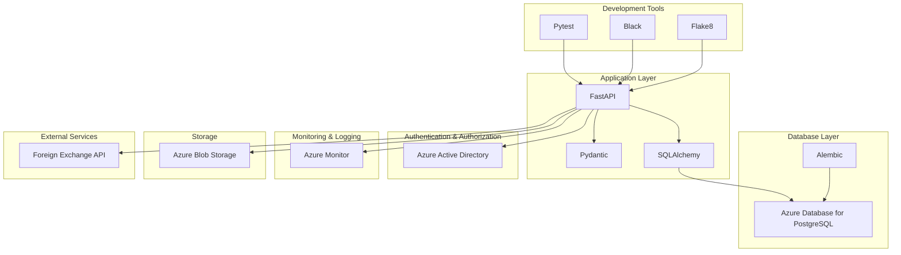

This technology stack ensures a robust, scalable, and maintainable backend platform that aligns with the project requirements and leverages the power of Azure cloud services.

# 6. SECURITY CONSIDERATIONS

## 6.1 AUTHENTICATION AND AUTHORIZATION

The backend platform will implement a robust authentication and authorization system to ensure secure access to financial data and API endpoints. The system will leverage Azure Active Directory (AAD) for identity management and implement Role-Based Access Control (RBAC) for fine-grained authorization.

### 6.1.1 Authentication

1. **Azure Active Directory Integration**:
   - The system will integrate with Azure Active Directory for user authentication.
   - Single Sign-On (SSO) will be supported for seamless access across the VC firm's ecosystem.

2. **Multi-Factor Authentication (MFA)**:
   - MFA will be enforced for all user accounts to provide an additional layer of security.

3. **OAuth 2.0 and OpenID Connect**:
   - The system will implement OAuth 2.0 with OpenID Connect for secure token-based authentication.

4. **JWT Tokens**:
   - JSON Web Tokens (JWT) will be used for stateless authentication between the client and the API.

### 6.1.2 Authorization

1. **Role-Based Access Control (RBAC)**:
   - RBAC will be implemented to control access to API endpoints and data based on user roles.
   - The following roles will be defined:

| Role | Description | Permissions |
|------|-------------|-------------|
| Admin | System administrators | Full access to all endpoints and data |
| Portfolio Manager | VC firm portfolio managers | Read access to all financial data, write access to company information |
| Analyst | Financial analysts | Read access to financial data, no write access |
| Company User | Portfolio company representatives | Write access to own company's input metrics, read access to own company's data |

2. **Least Privilege Principle**:
   - Users will be granted the minimum level of access required to perform their tasks.

3. **API Scope-based Access**:
   - OAuth 2.0 scopes will be used to define and restrict access to specific API endpoints.

### 6.1.3 Authentication and Authorization Flow

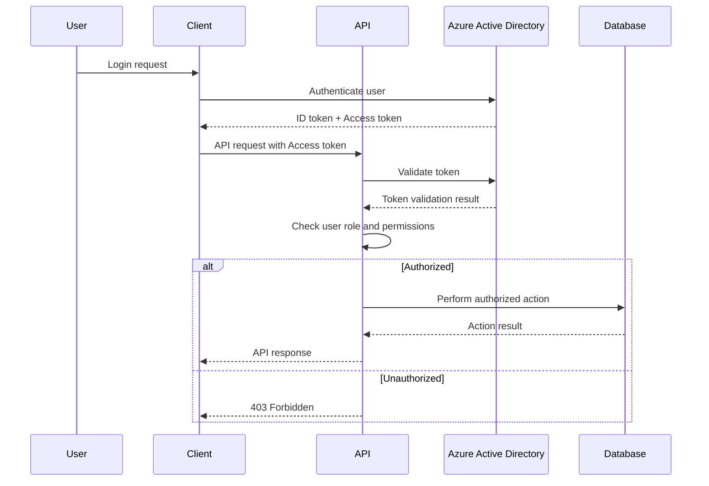

## 6.2 DATA SECURITY

Protecting sensitive financial information is crucial for the backend platform. The following measures will be implemented to ensure data security:

### 6.2.1 Encryption

1. **Encryption at Rest**:
   - All data stored in Azure Database for PostgreSQL will be encrypted using Azure-managed keys.
   - Backups and archived data in Azure Blob Storage will also be encrypted.

2. **Encryption in Transit**:
   - All data transmissions will be encrypted using TLS 1.2 or higher.
   - HTTPS will be enforced for all API communications.

### 6.2.2 Data Masking

- Sensitive financial data will be masked for non-privileged users to prevent unauthorized access to complete information.

### 6.2.3 Data Isolation

- Database schema design will ensure proper isolation of data between different portfolio companies.

### 6.2.4 Key Management

- Azure Key Vault will be used for secure storage and management of encryption keys, certificates, and secrets.

### 6.2.5 Data Backup and Recovery

- Regular automated backups will be performed and stored in a separate, encrypted Azure storage account.
- A comprehensive disaster recovery plan will be implemented to ensure data can be restored in case of any incidents.

## 6.3 SECURITY PROTOCOLS

The following security protocols and standards will be implemented to maintain system security:

### 6.3.1 Network Security

1. **Azure Virtual Network**:
   - The backend services will be deployed within an Azure Virtual Network for network isolation.

2. **Network Security Groups (NSGs)**:
   - NSGs will be configured to control inbound and outbound traffic to the backend resources.

3. **Web Application Firewall (WAF)**:
   - Azure Application Gateway with WAF will be implemented to protect against common web vulnerabilities.

### 6.3.2 Monitoring and Logging

1. **Azure Monitor**:
   - Comprehensive monitoring of the backend platform will be implemented using Azure Monitor.

2. **Security Information and Event Management (SIEM)**:
   - Azure Sentinel will be used for advanced threat detection and response.

3. **Audit Logging**:
   - Detailed audit logs will be maintained for all system access and data modifications.

### 6.3.3 Vulnerability Management

1. **Regular Security Assessments**:
   - Periodic vulnerability scans and penetration testing will be conducted.

2. **Patch Management**:
   - A robust patch management process will be implemented to keep all systems up-to-date.

### 6.3.4 Incident Response Plan

- A comprehensive incident response plan will be developed and regularly tested to ensure quick and effective response to security incidents.

### 6.3.5 Security Compliance

- The system will adhere to industry-standard security frameworks and compliance requirements, including:
  - ISO 27001
  - SOC 2 Type II
  - GDPR and CCPA for data protection

### 6.3.6 API Security

1. **Rate Limiting**:
   - Implement rate limiting to prevent API abuse and potential DDoS attacks.

2. **Input Validation**:
   - Strict input validation will be performed on all API endpoints to prevent injection attacks.

3. **API Versioning**:
   - Implement API versioning to ensure backward compatibility and secure updates.

### 6.3.7 Security Protocols Summary

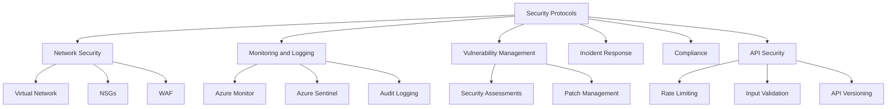

By implementing these comprehensive security measures, the backend platform will maintain a strong security posture, protecting sensitive financial data and ensuring compliance with industry standards and regulations.

# INFRASTRUCTURE

## DEPLOYMENT ENVIRONMENT

The backend platform for storing and retrieving financial reporting metrics will be deployed entirely in the cloud, leveraging Azure's comprehensive suite of services. This cloud-native approach ensures scalability, reliability, and ease of management.

| Environment | Description | Justification |
|-------------|-------------|---------------|
| Production | Azure Cloud | - Aligns with existing Azure infrastructure<br>- Provides robust security features<br>- Offers scalable and managed services |
| Staging | Azure Cloud | - Mirrors production environment for accurate testing<br>- Allows for seamless promotion of changes |
| Development | Azure Cloud | - Ensures consistency across all environments<br>- Facilitates easy integration with CI/CD pipelines |

## CLOUD SERVICES

The following Azure services will be utilized for the backend platform:

| Service | Purpose | Justification |
|---------|---------|---------------|
| Azure Database for PostgreSQL | Primary database | - Fully managed PostgreSQL service<br>- Automatic backups and high availability<br>- Scalable performance |
| Azure App Service | Hosting FastAPI application | - Supports Python and FastAPI<br>- Easy scaling and deployment<br>- Built-in load balancing |
| Azure Functions | Data transformation processes | - Serverless compute for background jobs<br>- Cost-effective for periodic tasks<br>- Easy integration with other Azure services |
| Azure Active Directory | Authentication and authorization | - Centralized identity management<br>- Supports OAuth 2.0 and OpenID Connect<br>- Integrates well with other Azure services |
| Azure Key Vault | Secrets and key management | - Secure storage of API keys and credentials<br>- Centralized management of encryption keys |
| Azure Monitor | Monitoring and logging | - Comprehensive monitoring solution<br>- Application Insights for performance tracking<br>- Log Analytics for centralized logging |
| Azure Blob Storage | Data archiving and backups | - Cost-effective long-term storage<br>- Integrates well with Azure Database for PostgreSQL |

## CONTAINERIZATION

While the current architecture does not strictly require containerization, we will use Docker to containerize the FastAPI application and Azure Functions for consistency and portability across environments.

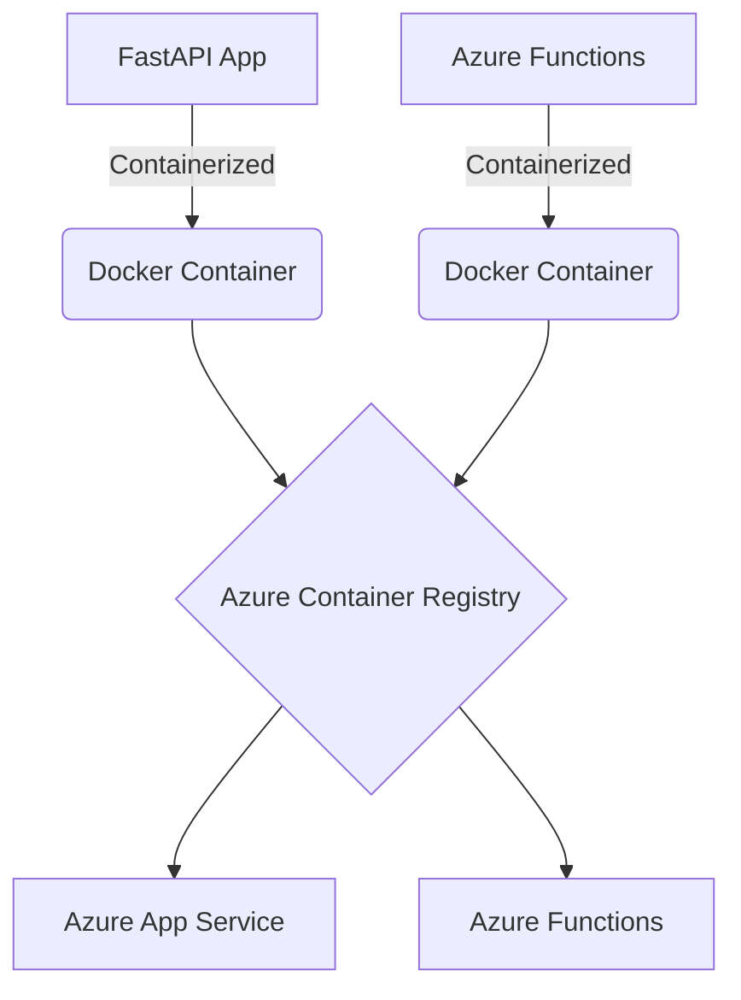

Justification for using Docker:
1. Consistency across development, staging, and production environments
2. Easier management of dependencies
3. Improved scalability and resource utilization
4. Facilitates CI/CD processes

## ORCHESTRATION

For the current scale of the application, we will not implement a full container orchestration solution like Kubernetes. Instead, we will leverage Azure's built-in orchestration capabilities:

1. Azure App Service will handle scaling and management of the FastAPI application containers.
2. Azure Functions will manage the execution and scaling of the data transformation process containers.

If the system's complexity grows significantly in the future, we may consider migrating to Azure Kubernetes Service (AKS) for more advanced orchestration capabilities.

## CI/CD PIPELINE

We will implement a robust CI/CD pipeline using Azure DevOps to automate the build, test, and deployment processes.

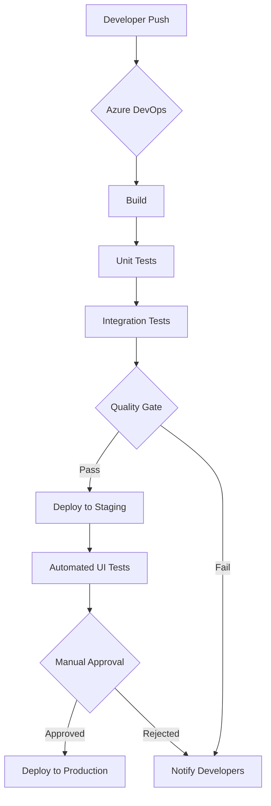

Key components of the CI/CD pipeline:

1. **Source Control**: Azure Repos (Git) for version control
2. **Build Automation**: Azure Pipelines to build Docker images and run tests
3. **Artifact Repository**: Azure Container Registry to store Docker images
4. **Deployment Automation**: Azure Pipelines for deploying to different environments
5. **Infrastructure as Code**: Azure Resource Manager (ARM) templates for defining and versioning infrastructure

Pipeline Stages:

1. **Build**: Compile code and create Docker images
2. **Unit Testing**: Run unit tests within the build process
3. **Integration Testing**: Deploy to a test environment and run integration tests
4. **Quality Gate**: Run code analysis tools (e.g., SonarQube) to ensure code quality
5. **Staging Deployment**: Automatically deploy to the staging environment
6. **UI Testing**: Run automated UI tests against the staging environment
7. **Manual Approval**: Require manual approval for production deployments
8. **Production Deployment**: Deploy approved changes to the production environment

This CI/CD pipeline ensures consistent, reliable, and automated deployments while maintaining high code quality and providing opportunities for manual oversight where necessary.

# APPENDICES

## A. TECHNICAL INFORMATION

### A.1 Database Indexing Strategy

To optimize query performance, the following indexes will be created:

```sql
CREATE INDEX idx_companies_name ON Companies(name);
CREATE INDEX idx_metrics_input_company_date ON Metrics_Input(company_id, fiscal_reporting_date);
CREATE INDEX idx_quarterly_financials_company_date ON Quarterly_Reporting_Financials(company_id, fiscal_reporting_date);
CREATE INDEX idx_quarterly_metrics_company_date ON Quarterly_Reporting_Metrics(company_id, fiscal_reporting_date);
```

### A.2 API Rate Limiting

To prevent API abuse, rate limiting will be implemented using the following headers:

```
X-RateLimit-Limit: 1000
X-RateLimit-Remaining: 999
X-RateLimit-Reset: 1623456789
```

### A.3 Error Response Format

The API will return detailed error messages in a consistent JSON format:

```json
{
  "error": {
    "code": "INVALID_INPUT",
    "message": "The provided input is invalid.",
    "details": [
      {
        "field": "total_revenue",
        "issue": "Must be a positive number"
      }
    ]
  }
}
```

## B. GLOSSARY

| Term | Definition |
|------|------------|
| Portfolio Company | A company in which the VC firm has invested |
| Annual Recurring Revenue (ARR) | The value of the contracted recurring revenue components of term subscriptions normalized to a one-year period |
| Last Twelve Months (LTM) | A time frame that refers to the past 12 consecutive months of financial data |
| Enterprise Value (EV) | A measure of a company's total value, calculated as the market capitalization plus debt, minority interest and preferred shares, minus total cash and cash equivalents |
| Runway | The amount of time a company has before it runs out of cash, assuming current revenue and expense levels |
| Year-over-Year (YoY) Growth | The percentage change in a specific metric compared to the same period from the previous year |
| Gross Margin | The difference between revenue and cost of goods sold, divided by revenue |
| Burn Rate | The rate at which a company is losing money, typically measured monthly |
| Post-Money Valuation | The value of a company immediately after the latest round of financing |

## C. ACRONYMS

| Acronym | Expanded Form |
|---------|---------------|
| VC | Venture Capital |
| API | Application Programming Interface |
| REST | Representational State Transfer |
| SQL | Structured Query Language |
| UUID | Universally Unique Identifier |
| EBITDA | Earnings Before Interest, Taxes, Depreciation, and Amortization |
| FTE | Full-Time Equivalent |
| EV | Enterprise Value |
| SMB | Small and Medium-sized Business |
| LTM | Last Twelve Months |
| YoY | Year-over-Year |
| RBAC | Role-Based Access Control |
| TLS | Transport Layer Security |
| JWT | JSON Web Token |
| AMQP | Advanced Message Queuing Protocol |
| SAS | Shared Access Signature |
| GDPR | General Data Protection Regulation |
| CCPA | California Consumer Privacy Act |
| ISO | International Organization for Standardization |
| GAAP | Generally Accepted Accounting Principles |
| IFRS | International Financial Reporting Standards |
| MTBF | Mean Time Between Failures |
| MTTR | Mean Time To Recover |
| SOC | Service Organization Control |
| WAF | Web Application Firewall |
| NSG | Network Security Group |
| SIEM | Security Information and Event Management |
| DDoS | Distributed Denial of Service |